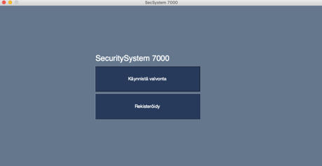
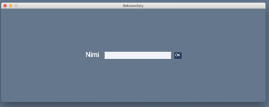
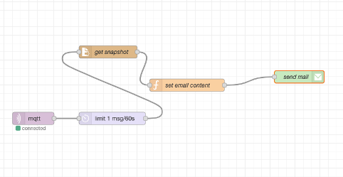

# IOT-projekti - Kalle Lehikoinen TTV20SM

## Kasvojentunnistusjärjestelmä

Järjestelmä tunnistaa web-kameran kuvasta tuntemattomat kasvot ja lähettää ilmoituksen siitä käyttäjän sähköpostiin. Järjestelmä voisi käyttää esimerkiksi valvontakameraan tai yksinkertaiseen kulunvalvontaan.

Projektissa käytetään Raspberry Pi:tä, johon on yhdistetty webkamera. Pi:llä ajetaan Python-ohjelmaa, jossa on yksinkertainen käyttöliittymä. Käyttöliittymästä voi käynnistää valvonnan ja rekisteröidä kasvot. Ohjelmassa on käytetty [face_recognition](https://pypi.org/project/face-recognition/)-kirjastoa kasvojen tunnistamiseen.

Järjestelmään voi rekisteröityä painamalla Rekisteröidy-painiketta ja syöttämällä nimen. Tämän jälkeen kamera ottaa kuvan ja tallentaa sen. Nimi ja osoite kuvan sijaintiin tallennetaan JSON-objektiin.

Valvonnan ollessa käynnissä ohjelma tarkastelee, onko webkameran kuvassa kasvoja. Jos kasvot löytyvät, niitä verrataan rekisteröityjen käyttäjien kasvoihin. Kun ohjelma tunnistaa tuntemattomat kasvot, se tallentaa kuvan tuntemattomista kasvoista
paikallisesti ja lähettää MQTT-protokollaa käyttäen viestin Node-REDin MQTT-solmulle.

MQTT-brokerina, eli viestien välittäjän toimii toinen tietokone, joka on samassa lähiverkossa. Brokerina olisi varmaan voinut toimia myös sama Raspberry Pi, jossa ohjelmisto ajetaan, mutta halusin kokeilla välittää viestejä lähiverkossa. Broker-ohjelmana käytetään Mosquittoa.
Itse valvontajärjestelmässä on käytetty [paho-mqtt](https://pypi.org/project/paho-mqtt/) -kirjastoa viestien lähettämiseen.

Saatuaan viestin Node-Red lataa kuvan paikalliselta levyltä, valmistelee sähköpostiviestin ja lähettää sen ennalta määrättyyn sähköpostiosoitteeseen. Tuntemattoman henkilön tunnistamisen jälkeen käynnistyy minuutin cooldown-jakso, jolloin järjestelmä ei lähetä uutta viestiä, vaikka uudet tuntemattomat kasvot tunnistetaan.

Järjestelmää ei voisi käyttää kovin korkean tason valvontaan, koska se ei tunnista onko kyseessä kolmiulotteiset kasvot vai pelkkä kuva kasvoista.

